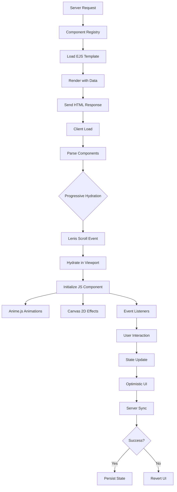
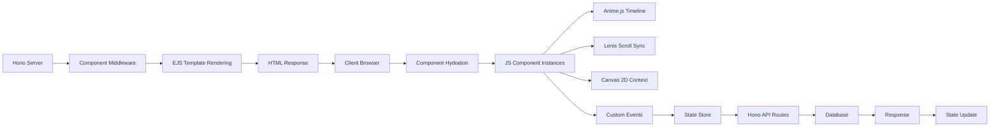

# Lux Sunglasses Store: Modular UI System Plan (Hybrid Approach)

## Executive Summary

This plan outlines a **hybrid server-side + client-side modular UI system** for the Lux Sunglasses Store using Bun, Hono.js, EJS, JavaScript, Lenis, and Anime.js. The system balances performance, interactivity, and maintainability by leveraging server-side EJS templating for initial renders and client-side JavaScript components for rich interactions.

The architecture is designed to be **beautiful, smooth, and clean** - providing a seamless developer experience with clear separation of concerns, progressive enhancement, and optimal performance through Canvas 2D integration for visual effects.

## Approach Overview

### Why Hybrid?
The hybrid approach combines the best of both worlds:
- **Server-side EJS**: Fast initial page loads, SEO-friendly, progressive enhancement
- **Client-side JS**: Rich interactivity, smooth animations, dynamic updates
- **Canvas 2D**: High-performance visual effects without bloating the JS bundle

## Addressing Hybrid Cons with Elegant Solutions

### 1. Complex Architecture → Component Registry Pattern
**Problem**: Dual rendering concerns create maintenance overhead.

**Solution**: Implement a unified Component Registry that manages both server and client aspects:

```javascript
// components/registry.js
class ComponentRegistry {
  static register(name, config) {
    this.components[name] = {
      serverTemplate: config.template, // EJS template path
      clientComponent: config.component, // JS class
      styles: config.styles, // CSS path
      dependencies: config.dependencies // Client-side deps
    };
  }

  static renderServer(name, data) {
    const config = this.components[name];
    return ejs.renderFile(config.serverTemplate, data);
  }

  static hydrateClient(name, element) {
    const config = this.components[name];
    return new config.clientComponent(element);
  }
}
```

### 2. Hydration Mismatches → Progressive Hydration
**Problem**: Server and client renders can diverge.

**Solution**: Lazy hydration triggered by user interactions and scroll events:

```javascript
// Progressive hydration with Lenis scroll events
lenis.on('scroll', (e) => {
  const components = document.querySelectorAll('[data-component]:not(.hydrated)');
  components.forEach(el => {
    if (isElementInViewport(el)) {
      ComponentRegistry.hydrateClient(el.dataset.component, el);
      el.classList.add('hydrated');
    }
  });
});
```

### 3. Bundle Size → Code Splitting & Component-Level Bundling
**Problem**: Large client-side bundles impact performance.

**Solution**: Each component bundles its own dependencies:

```javascript
// components/ui/product-card/component.js
import anime from 'animejs'; // Only loaded for this component

export class ProductCard {
  constructor(element) {
    this.element = element;
    this.init();
  }

  init() {
    // Component-specific logic with anime.js
    anime({
      targets: this.element,
      opacity: [0, 1],
      translateY: [20, 0],
      duration: 600
    });
  }
}
```

### 4. Maintenance Overhead → Automated Component Scaffolding
**Problem**: More moving parts increase maintenance burden.

**Solution**: Bun-based CLI for component generation:

```bash
bun run create-component product-card
# Creates:
# - components/ui/product-card/template.ejs
# - components/ui/product-card/component.js
# - components/ui/product-card/styles.css
# - Registers in ComponentRegistry
```

### 5. State Synchronization → Event-Driven Architecture
**Problem**: Server and client state can become unsynchronized.

**Solution**: Custom events with optimistic updates:

```javascript
// Cart component - optimistic updates with server sync
class Cart {
  addItem(productId) {
    // Optimistic UI update
    this.updateUI({ ...this.items, [productId]: (this.items[productId] || 0) + 1 });

    // Server sync
    fetch('/api/cart', {
      method: 'POST',
      body: JSON.stringify({ productId, action: 'add' })
    }).then(response => {
      if (!response.ok) {
        // Revert on failure
        this.revertUI();
      }
    });
  }
}
```

## System Architecture

```
lux-sunglasses/
├── components/
│   ├── base/
│   │   ├── Component.js          # Base component class
│   │   ├── Registry.js           # Component registry
│   │   └── Hydrator.js           # Progressive hydration
│   ├── ui/
│   │   ├── product-card/
│   │   │   ├── template.ejs      # Server-side template
│   │   │   ├── component.js      # Client-side logic
│   │   │   └── styles.css        # Component styles
│   │   ├── hero/
│   │   │   ├── template.ejs
│   │   │   ├── component.js      # Canvas 2D integration
│   │   │   └── styles.css
│   │   └── cart-modal/
│   │       ├── template.ejs
│   │       ├── component.js
│   │       └── styles.css
│   └── canvas/
│       ├── LensReflection.js     # Canvas 2D lens effects
│       ├── ParticleSystem.js     # Particle animations
│       └── Effects.js            # Shared canvas utilities
├── server/
│   ├── app.js                    # Hono server setup
│   ├── routes/
│   │   ├── pages.js              # Page routes with component rendering
│   │   └── api.js                # API routes
│   └── middleware/
│       └── component-middleware.js # Server-side component rendering
├── client/
│   ├── app.js                    # Client bootstrap
│   ├── utils/
│   │   ├── lenis.js              # Lenis initialization
│   │   ├── anime.js              # Animation utilities
│   │   └── intersection.js       # Viewport detection
│   └── stores/
│       └── cart.js               # Client-side state management
├── public/
│   ├── styles/
│   │   └── main.css
│   └── images/
├── tests/
│   ├── components/               # Component tests
│   └── integration/              # E2E tests
└── package.json
```

## Component Lifecycle



## Data Flow Architecture



## Canvas 2D Integration

Canvas 2D is beautifully integrated for high-performance visuals:

```javascript
// components/canvas/LensReflection.js
export class LensReflection {
  constructor(canvas) {
    this.canvas = canvas;
    this.ctx = this.canvas.getContext('2d');
    this.setupCanvas();
  }

  drawLens(x, y, size = 40) {
    // High-performance Canvas 2D rendering
    this.ctx.fillStyle = 'rgba(0, 0, 0, 0.8)';
    this.ctx.beginPath();
    this.ctx.ellipse(x, y, size, size * 0.75, 0, 0, Math.PI * 2);
    this.ctx.fill();

    // Mouse-following glint effect
    const angle = Math.atan2(this.mouseY - y, this.mouseX - x);
    const glintX = x + Math.cos(angle) * 25;
    const glintY = y + Math.sin(angle) * 25;

    this.ctx.fillStyle = 'rgba(255, 255, 255, 0.4)';
    this.ctx.beginPath();
    this.ctx.ellipse(glintX, glintY, 12, 18, angle, 0, Math.PI * 2);
    this.ctx.fill();
  }

  animate() {
    this.ctx.clearRect(0, 0, this.canvas.width, this.canvas.height);
    this.drawLens(this.canvas.width / 2, this.canvas.height / 2, 1.5);
    requestAnimationFrame(() => this.animate());
  }
}
```

## Implementation Roadmap

### Phase 1: Core Infrastructure (Week 1)
- [ ] Set up Bun + Hono server
- [ ] Create Component Registry system
- [ ] Implement basic EJS templating
- [ ] Set up project structure

### Phase 2: Component System (Week 2)
- [ ] Build base Component class
- [ ] Create ProductCard component
- [ ] Implement progressive hydration
- [ ] Add component CLI generator

### Phase 3: Canvas Integration (Week 3)
- [ ] Implement LensReflection class
- [ ] Create ParticleSystem
- [ ] Integrate with Lenis scrolling
- [ ] Add Anime.js timelines

### Phase 4: Advanced Features (Week 4)
- [ ] Add cart functionality
- [ ] Implement state synchronization
- [ ] Add admin dashboard
- [ ] Performance optimization

### Phase 5: Polish & Testing (Week 5)
- [ ] Code splitting implementation
- [ ] Comprehensive testing
- [ ] Performance monitoring
- [ ] Documentation

## Performance Optimizations

1. **Code Splitting**: Components load their dependencies lazily
2. **Canvas Offloading**: Complex visuals use GPU-accelerated Canvas 2D
3. **Progressive Enhancement**: Core functionality works without JavaScript
4. **Lazy Hydration**: Components hydrate only when needed
5. **Bundle Analysis**: Regular bundle size monitoring

## Conclusion

This hybrid approach creates a **beautiful, smooth, and clean** modular UI system that leverages the strengths of each technology:

- **Server-side EJS** for fast, SEO-friendly initial renders
- **Client-side JS** for rich interactions and dynamic updates
- **Canvas 2D** for high-performance visual effects
- **Lenis & Anime.js** for buttery-smooth scrolling and animations
- **Component Registry** for maintainable, scalable architecture

The system provides the best of both worlds: server-side performance with client-side interactivity, all wrapped in a clean, modular architecture that's easy to maintain and extend.

## Open Questions

1. Should we implement server-side component caching?
2. What level of TypeScript integration do you prefer?
3. Do you want WebSocket support for real-time cart updates?
4. Should we add a design system with CSS custom properties?

---

*This plan was generated in collaboration with Roo (technical leader AI) and is ready for brainstorming with Claude AI.*